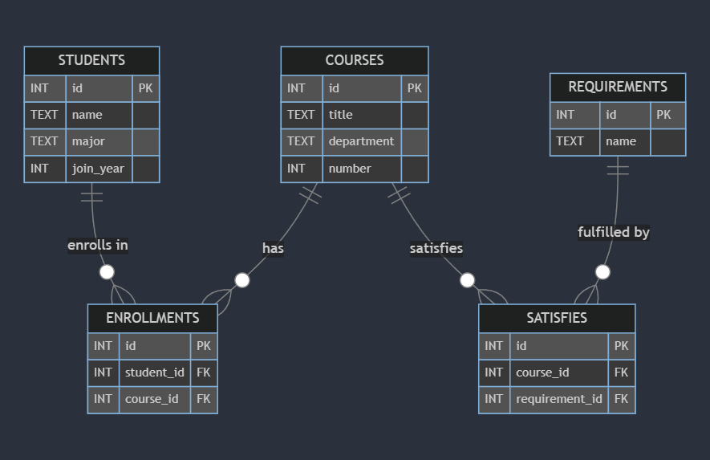

# Design Document

By SAMEH ELWAN

[Video overview](https://youtu.be/VK9Zm07rDog)

## Scope

**Purpose of the Database:**
The purpose of this database is to manage and track the enrollment of students in courses and to manage course requirements. It supports functionalities such as listing students enrolled in specific courses and tracking which requirements are satisfied by which courses.

**Included in the Scope:**
- **People:** Students
- **Places:** Courses (as part of the curriculum)
- **Things:** Enrollment records, course requirements, and the relationships between courses and their requirements.

**Outside the Scope:**
- **People:** Faculty, administrative staff (the database does not handle their information)
- **Places:** Other academic entities not related to the courses (e.g., classrooms, departments beyond what’s tied to courses)
- **Things:** Detailed records of course grades, student attendance, and other academic performance metrics.

## Functional Requirements

**User Capabilities:**
- View a list of students and the courses they are enrolled in.
- View a list of courses along with the requirements they satisfy.

**Beyond the Scope:**
- The database does not support functionality for managing course grades, student progress, or any other academic performance indicators.
- It does not include functionalities for course scheduling, student advising, or financial aid.

## Representation

### Entities
1. **Students:**
   - **Attributes:** `id` (INT, Primary Key), `name` (TEXT), `major` (TEXT), `join_year` (INT)
   - **Reason for Attributes and Types:**
     - `id` as INT to uniquely identify each student.
     - `name`, `major` as TEXT to store variable-length strings.
     - `join_year` as INT to represent the year the student joined.

2. **Courses:**
   - **Attributes:** `id` (INT, Primary Key), `title` (TEXT), `department` (TEXT), `number` (INT)
   - **Reason for Attributes and Types:**
     - `id` as INT to uniquely identify each course.
     - `title`, `department` as TEXT for variable-length strings describing the course.
     - `number` as INT to represent the course number.

3. **Enrollments:**
   - **Attributes:** `id` (INT, Primary Key), `student_id` (INT), `course_id` (INT)
   - **Reason for Attributes and Types:**
     - `id` as INT for unique identification.
     - `student_id`, `course_id` as INT to reference IDs from `students` and `courses`.

4. **Requirements:**
   - **Attributes:** `id` (INT, Primary Key), `name` (TEXT)
   - **Reason for Attributes and Types:**
     - `id` as INT for unique identification.
     - `name` as TEXT to describe the requirement.

5. **Satisfies:**
   - **Attributes:** `id` (INT, Primary Key), `course_id` (INT), `requirement_id` (INT)
   - **Reason for Attributes and Types:**
     - `id` as INT for unique identification.
     - `course_id`, `requirement_id` as INT to link to `courses` and `requirements`.

### Relationships

- **Students** are related to **Courses** through **Enrollments** (many-to-many relationship).
- **Courses** are related to **Requirements** through **Satisfies** (many-to-many relationship).
### Entity-Relationship Diagram (ERD)

## Optimizations

**Indexes:**
- **`search_courses_by_title`:** Optimizes queries filtering by course title.
- **`search_courses_by_department`:** Speeds up searches by department.
- **`search_enrollments_by_student_id`:** Improves performance when querying enrollments by student ID.
- **`search_satisfies_by_course_id`:** Enhances efficiency for finding requirements related to a specific course.

**Views:**
- **`list_of_enrollments`:** Provides a straightforward view of which students are enrolled in which courses.
- **`list_of_satisfies`:** Shows which courses satisfy which requirements, simplifying queries related to course requirements.

## Limitations
- The database does not capture detailed course schedules or additional aspects of student performance.
- There is no support for multi-semester course offerings or varying course credits.
